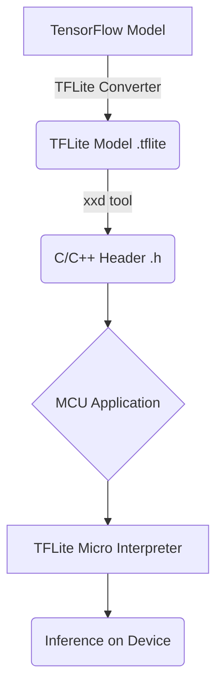

# TFLite Micro와 ONNX Runtime Mobile

## 1. 핵심 개념 (Core Concept)

\*\*TensorFlow Lite Micro (TFLite Micro)\*\*는 TensorFlow Lite를 더욱 경량화하여, 운영체제(OS) 없이 수 킬로바이트(KB)의 메모리만 가진 마이크로컨트롤러(MCU) 및 임베디드 시스템에서 ML 모델을 실행하기 위해 설계된 런타임임. TinyML의 핵심 기술 중 하나임.

**ONNX Runtime Mobile**은 표준 ML 모델 포맷인 ONNX를 모바일(Android, iOS) 및 엣지 디바이스에서 효율적으로 실행하기 위한 고성능 크로스플랫폼 추론 엔진임. 바이너리 크기 최소화와 다양한 하드웨어 가속 지원에 중점을 둠.

______________________________________________________________________

## 2. 상세 설명 (Detailed Explanation)

### 2.1 TensorFlow Lite Micro (TFLite Micro)

TFLite Micro는 극도로 제한된 리소스를 가진 환경을 목표로 함. 이를 위해 동적 메모리 할당(e.g., `malloc`)을 전혀 사용하지 않고, 필요한 메모리를 사전에 정적으로 할당하는 방식을 사용함. 이 메모리 영역을 **Tensor Arena**라고 부름.



*<center>그림 1: TFLite Micro 모델 배포 워크플로우</center>*

**주요 특징**:

- **초경량**: 코어 런타임이 Arm Cortex-M3 기준 16KB 수준으로 매우 작음.
- **OS 불필요 (Bare-metal)**: 별도의 OS 없이 하드웨어 위에서 직접 동작 가능함.
- **제한된 연산자(Op) 지원**: 전체 TensorFlow 연산자의 일부만 지원함. 모델에 필요한 연산자만 선택적으로 포함하여 바이너리 크기를 최소화함.
- **수동 메모리 관리**: 개발자가 코드 내에 `Tensor Arena`의 크기를 직접 명시하고 관리해야 함.
- **저전력 최적화**: 네트워크 통신 없이 디바이스 자체에서 추론을 수행하여 전력 소모와 지연 시간을 크게 줄일 수 있음.

### 2.2 ONNX Runtime Mobile

ONNX Runtime Mobile은 "한 번 학습시키면 어디서든 실행한다(Train once, run anywhere)"는 ONNX의 철학을 모바일 환경으로 확장함. PyTorch, TensorFlow 등 다양한 프레임워크에서 학습된 모델을 ONNX 포맷으로 변환한 뒤, ONNX Runtime을 통해 Android, iOS 등 여러 플랫폼에서 일관되게 실행할 수 있음.

**주요 특징**:

- **바이너리 크기 최적화**: 모델에 필요한 연산자만 포함하는 **커스텀 빌드**를 지원함. 이를 통해 불필요한 코드를 제거하여 런타임 라이브러리의 크기를 수십 MB에서 수 MB 수준으로 크게 줄일 수 있음. 최적화를 위해 모델을 `.onnx`에서 `.ort` 포맷으로 변환하여 사용함.
- **하드웨어 가속 (Execution Providers, EP)**: 플랫폼별 하드웨어 가속기를 추상화된 인터페이스(EP)로 제공함.
  - **NNAPI (Android)**: Android의 Neural Networks API를 통해 GPU, DSP, NPU 가속.
  - **Core ML (iOS)**: Apple의 Core ML 프레임워크를 통해 Neural Engine(ANE) 가속.
  - **XNNPACK**: ARM CPU에 고도로 최적화된 연산을 제공하는 CPU 가속기.
- **크로스플랫폼 일관성**: 동일한 ONNX 모델 파일과 API를 사용하여 Android(Java/Kotlin)와 iOS(Objective-C/Swift)에서 일관된 결과를 얻을 수 있음.
- **유연성**: 개발자가 전처리 및 후처리 로직을 직접 제어하며, 다양한 프레임워크에서 생성된 모델을 자유롭게 사용할 수 있음.

______________________________________________________________________

## 3. 예시 (Example)

### TFLite Micro 추론 (C++)

```cpp
#include "tensorflow/lite/micro/micro_interpreter.h"
#include "tensorflow/lite/micro/micro_op_resolver.h"
#include "tensorflow/lite/schema/schema_generated.h"
#include "my_model_data.h" // 모델 데이터 (C 배열)

// 1. 연산자(Op) 리졸버 설정
tflite::MicroMutableOpResolver<3> op_resolver;
op_resolver.AddConv2D();
op_resolver.AddMaxPool2D();
op_resolver.AddSoftmax();

// 2. Tensor Arena (메모리 버퍼) 할당
constexpr int kTensorArenaSize = 10 * 1024; // 10KB
uint8_t tensor_arena[kTensorArenaSize];

// 3. 모델 로드 및 인터프리터 생성
const tflite::Model* model = tflite::GetModel(g_my_model_data);
tflite::MicroInterpreter interpreter(model, op_resolver, tensor_arena, kTensorArenaSize);
interpreter.AllocateTensors();

// 4. 입력 설정 및 추론 실행
TfLiteTensor* input = interpreter.input(0);
input->data.f[0] = 1.0f; // 입력 데이터 채우기
interpreter.Invoke();

// 5. 결과 확인
TfLiteTensor* output = interpreter.output(0);
float result = output->data.f[0];
```

### ONNX Runtime Mobile 추론 (Android/Java)

```java
import ai.onnxruntime.OrtEnvironment;
import ai.onnxruntime.OrtSession;
import ai.onnxruntime.OnnxTensor;

// 1. ONNX Runtime 환경 생성
OrtEnvironment env = OrtEnvironment.getEnvironment();

// 2. 모델 파일 경로와 세션 옵션 설정
String modelPath = "/path/to/your/model.ort";
OrtSession.SessionOptions options = new OrtSession.SessionOptions();
// options.addNnapi(); // NNAPI Execution Provider 활성화

// 3. 추론 세션 생성
OrtSession session = env.createSession(modelPath, options);

// 4. 입력 텐서 생성
float[] inputData = {1.0f, 2.0f, 3.0f};
long[] inputShape = {1, 3};
OnnxTensor inputTensor = OnnxTensor.createTensor(env, inputData, inputShape);

// 5. 추론 실행
OrtSession.Result result = session.run(Collections.singletonMap("input_name", inputTensor));

// 6. 결과 텐서 가져오기
float[] output = (float[]) result.get(0).getValue();
```

______________________________________________________________________

## 4. 예상 면접 질문 (Potential Interview Questions)

- **Q. TFLite Micro는 일반 TFLite와 어떤 점이 다른가요?**
  - **A.** 두 기술은 대상 기기와 동작 환경에서 근본적인 차이가 있습니다. TFLite는 스마트폰처럼 OS와 충분한 메모리가 있는 고성능 엣지 기기를 대상으로 하지만, TFLite Micro는 OS가 없고 메모리가 수십 KB에 불과한 마이크로컨트롤러를 대상으로 합니다.

| 구분              | TensorFlow Lite                | TensorFlow Lite Micro                       |
| :---------------- | :----------------------------- | :------------------------------------------ |
| **대상 기기**     | 스마트폰, Raspberry Pi 등      | 마이크로컨트롤러(MCU), DSP 등               |
| **OS 의존성**     | OS 필요                        | OS 불필요 (Bare-metal)                      |
| **메모리 할당**   | 동적 할당 (Dynamic Allocation) | 정적 할당 (Static Allocation, Tensor Arena) |
| **바이너리 크기** | 상대적으로 큼 (MB 단위)        | 초경량 (KB 단위)                            |
| **지원 연산자**   | 폭넓은 연산자 지원             | 필수적인 연산자만 선별적 지원               |

- **Q. ONNX Runtime Mobile의 가장 큰 장점은 무엇이라고 생각하나요?**

  - **A.** \*\*상호운용성(Interoperability)\*\*과 \*\*최적화(Optimization)\*\*입니다. ONNX라는 표준 모델 포맷을 사용함으로써 PyTorch, TensorFlow 등 어떤 프레임워크에서 모델을 만들었는지에 구애받지 않고 다양한 플랫폼에서 사용할 수 있습니다. 또한, Execution Provider(EP) 아키텍처를 통해 코드를 거의 변경하지 않고도 각 플랫폼(Android NNAPI, iOS Core ML 등)의 네이티브 하드웨어 가속 기능을 최대한 활용하여 최적의 성능을 낼 수 있다는 것이 큰 장점입니다.

- **Q. 엣지 디바이스에서 런타임의 바이너리 크기가 중요한 이유는 무엇이며, ONNX Runtime Mobile은 이를 어떻게 해결하나요?**

  - **A.** 엣지 디바이스, 특히 모바일 앱은 사용자가 다운로드해야 하므로 앱의 전체 용량이 매우 중요합니다. 런타임 라이브러리가 크면 앱 용량이 불필요하게 커져 사용자에게 부담을 줍니다. ONNX Runtime Mobile은 이 문제를 해결하기 위해 **커스텀 빌드(Custom Build)** 기능을 제공합니다. 개발자는 배포할 모델에 실제로 사용되는 연산자(Operator) 목록만 추려서 해당 연산자 커널만 포함된, 맞춤형 초경량 런타임 라이브러리를 빌드할 수 있습니다. 이를 통해 범용 라이브러리 대비 용량을 획기적으로 줄일 수 있습니다.

______________________________________________________________________

## 5. 더 읽어보기 (Further Reading)

- [TensorFlow Lite Micro 공식 문서](https://www.tensorflow.org/lite/microcontrollers)
- [ONNX Runtime Mobile 공식 문서](https://onnxruntime.ai/docs/build/custom.html#mobile)
- [ONNX Execution Providers](https://onnxruntime.ai/docs/execution-providers/)
