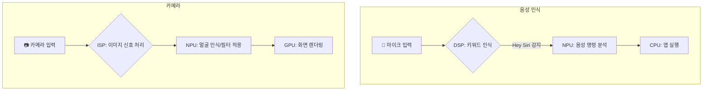

# Edge TPU, NPU, DSP

## 1. 핵심 개념 (Core Concept)

**Edge TPU, NPU, DSP**는 범용 CPU(Central Processing Unit)의 한계를 보완하여 엣지 디바이스에서 AI 연산을 효율적으로 처리하기 위해 설계된 \*\*하드웨어 가속기(Hardware Accelerator)\*\*들임.

- **Edge TPU (Tensor Processing Unit)**: Google이 개발한 AI 가속기 ASIC(주문형 반도체)으로, 저전력 환경에서 TensorFlow Lite 모델의 추론을 가속하는 데 고도로 특화됨.
- **NPU (Neural Processing Unit)**: 딥러닝의 핵심 연산(행렬 곱, 컨볼루션 등)을 하드웨어 수준에서 병렬로 처리하도록 설계된 범용 신경망 처리 장치. 다양한 딥러닝 모델 가속에 사용됨.
- **DSP (Digital Signal Processor)**: 오디오, 비디오 등 디지털 신호를 실시간으로 처리하는 데 특화된 프로세서. 특정 AI 연산(주로 센서, 오디오 관련)을 매우 낮은 전력으로 처리하는 데 강점이 있음.

______________________________________________________________________

## 2. 상세 설명 (Detailed Explanation)

엣지 AI의 핵심은 제한된 전력과 컴퓨팅 리소스 내에서 실시간으로 추론을 수행하는 것임. CPU만으로는 이러한 요구사항을 충족하기 어렵기 때문에, 특정 연산에 최적화된 하드웨어 가속기가 필수적임.

### 2.1 Edge TPU

Google의 Edge TPU는 **데이터 흐름(Dataflow)** 최적화에 중점을 둔 아키텍처를 가짐. 핵심은 **Systolic Array** 구조임.

- **Systolic Array**: 여러 개의 작은 처리 장치(PE, Processing Element)들이 그물망처럼 연결된 구조. 데이터가 한 번 입력되면 각 PE를 순차적으로 거치면서 연산이 수행되고 결과가 출력됨. 외부 메모리 접근을 최소화하여 행렬 곱셈과 같은 연산을 매우 낮은 지연 시간과 전력으로 처리할 수 있음.
- **주요 특징**:
  - **프레임워크 종속성**: TensorFlow Lite, 그중에서도 8비트 정수(INT8)로 양자화된 모델만 지원함. 이는 저전력, 고효율 설계를 위한 트레이드오프임.
  - **고효율**: 전력 1와트(Watt)당 높은 연산 성능(TOPS, Tera Operations Per Second)을 보여줌.
  - **제품 형태**: Google Coral Dev Board, USB Accelerator 등 개발 및 제품화가 용이한 형태로 제공됨.

### 2.2 NPU (Neural Processing Unit)

NPU는 특정 회사(Google)의 프레임워크에 종속되지 않는, 더 범용적인 AI 가속기임. Apple의 ANE(Apple Neural Engine), 삼성의 Exynos NPU, Qualcomm의 AI Engine 등이 모두 NPU에 해당함.

- **아키텍처**: 대량의 **MAC(Multiply-Accumulate)** 유닛을 병렬로 배치하여 한 번에 많은 연산을 동시에 처리하는 데 집중함. 이를 통해 다양한 딥러닝 모델의 연산을 가속함.
- **주요 특징**:
  - **범용성**: 다양한 딥러닝 프레임워크(TensorFlow Lite, PyTorch Mobile, ONNX Runtime 등)에서 변환된 모델을 지원함.
  - **이기종 컴퓨팅**: 모바일 AP(Application Processor) 내에서 CPU, GPU, DSP 등과 함께 통합되어, 작업의 종류에 따라 최적의 프로세서에 AI 연산을 할당하는 \*\*이기종 컴퓨팅(Heterogeneous Computing)\*\*의 핵심 요소로 동작함.

### 2.3 DSP (Digital Signal Processor)

DSP는 AI 연산을 위해 탄생한 프로세서는 아니지만, 특정 AI 작업에서 NPU보다 더 효율적일 수 있음.

- **아키텍처**: VLIW(Very Long Instruction Word), SIMD(Single Instruction, Multiple Data) 등 스트리밍 데이터의 연속적인 처리에 최적화된 구조를 가짐. Qualcomm Hexagon DSP가 대표적임.
- **AI에서의 역할**:
  - **Always-on 저전력 처리**: 스마트폰의 "Hey Google"과 같은 키워드 인식, 웨어러블 기기의 걸음 수 측정 등, 항상 켜져 있어야 하지만 전력 소모는 최소화해야 하는 작업에 사용됨.
  - **전처리/후처리**: NPU가 본격적인 AI 연산을 수행하기 전후의 데이터 처리(e.g., 오디오 노이즈 제거, 센서 데이터 필터링)를 담당하여 NPU의 부담을 덜어줌.

______________________________________________________________________

## 3. 아키텍처 비교

| 구분          | CPU                    | GPU                         | Edge TPU / NPU              | DSP                        |
| :------------ | :--------------------- | :-------------------------- | :-------------------------- | :------------------------- |
| **주요 목적** | 범용 계산, 순차 처리   | 대규모 병렬 처리 (그래픽)   | **신경망 연산 가속**        | 실시간 신호 처리           |
| **코어 구조** | 소수의 고성능 코어     | 수천 개의 단순 코어         | **수많은 MAC 유닛**         | VLIW, SIMD 특화 코어       |
| **강점**      | 복잡한 로직, 낮은 지연 | 높은 처리량 (Throughput)    | **전력 대비 성능 (TOPS/W)** | **초저전력**, 실시간성     |
| **AI 적용**   | 모델 제어, 소규모 추론 | 모델 학습, 복잡한 모델 추론 | **엣지 디바이스 추론**      | **Always-on 센싱**, 전처리 |

### 사용 사례: 스마트폰의 AI 기능 분담

*
그림 1: 스마트폰 내에서 각 하드웨어 가속기의 역할 분담 예시
*

______________________________________________________________________

## 4. 예상 면접 질문 (Potential Interview Questions)

- **Q. CPU만으로 AI 연산을 처리하지 않고 NPU나 Edge TPU 같은 별도의 하드웨어 가속기를 사용하는 이유는 무엇인가요?**

  - **A.** **전력 효율성**과 **성능** 때문입니다. CPU는 복잡한 제어와 순차적인 작업에 최적화되어 있어, 수많은 단순 연산이 병렬적으로 일어나는 딥러닝 모델을 처리하기에는 비효율적입니다. CPU로 AI 연산을 수행하면 속도가 느릴 뿐만 아니라 엄청난 전력을 소모하여 배터리가 빠르게 닳게 됩니다. NPU나 Edge TPU는 AI의 핵심 연산인 행렬 곱셈 등을 하드웨어 수준에서 직접 처리하므로, 훨씬 적은 전력으로 훨씬 빠르게 연산을 완료할 수 있습니다.

- **Q. Edge TPU와 스마트폰에 탑재된 일반적인 NPU(e.g., Apple ANE)의 가장 큰 차이점은 무엇일까요?**

  - **A.** 가장 큰 차이는 **범용성**과 **프레임워크 종속성**입니다. Edge TPU는 Google의 TensorFlow Lite 프레임워크, 특히 INT8 양자화 모델에 고도로 최적화된 **ASIC**입니다. 반면, 스마트폰의 NPU는 특정 프레임워크에 종속되지 않고 NNAPI, Core ML 같은 API를 통해 다양한 모델을 가속할 수 있는 **더 범용적인 프로세서**입니다. 따라서 Edge TPU는 특정 생태계 내에서 최고의 효율을 보이지만, NPU는 다양한 AI 애플리케이션을 지원해야 하는 스마트폰 환경에 더 적합합니다.

- **Q. NPU가 있는데도 DSP를 AI 연산에 사용하는 이유는 무엇인가요?**

  - **A.** **초저전력**이 필요한 특정 작업 때문입니다. NPU도 저전력이지만, 항상 켜져서 소리나 센서 값을 감지해야 하는 `Always-on` 기능의 경우 NPU를 계속 활성화하는 것조차 부담이 될 수 있습니다. DSP는 이런 종류의 연속적인 신호 처리를 NPU보다 훨씬 적은 전력으로 처리할 수 있습니다. 따라서 DSP가 1차로 신호를 감지해 특정 조건이 만족될 때만 NPU를 깨우는 계층적 접근을 통해 시스템 전체의 전력 소모를 최적화할 수 있습니다.

______________________________________________________________________

## 5. 더 읽어보기 (Further Reading)

- [Google Coral (Edge TPU) 공식 문서](https://coral.ai/)
- [How a Systolic Array works (Blog Post)](https://qengineering.eu/blog/how-a-systolic-array-works.html)
- [Apple Neural Engine (Official Page)](https://www.apple.com/newsroom/2020/11/apple-unleashes-m1/)
- [Qualcomm AI Engine (Hexagon Processor)](https://www.qualcomm.com/products/features/ai-engine)
