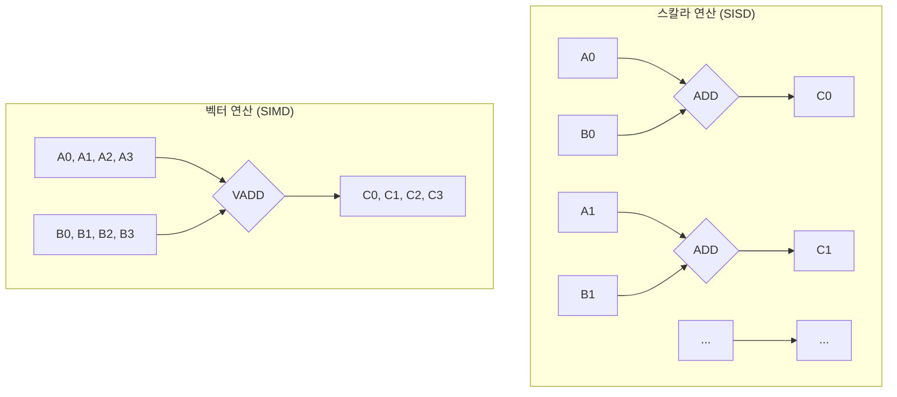

# SIMD와 ARM NEON

## 1. 핵심 개념 (Core Concept)

**SIMD (Single Instruction, Multiple Data)**는 하나의 명령어로 여러 개의 데이터 요소를 동시에 병렬 처리하는 컴퓨팅 방식임. 데이터 수준 병렬성(Data-Level Parallelism)을 활용하여, 특히 멀티미디어, 그래픽, 과학 계산 및 AI 연산의 성능을 크게 향상시키는 기술임.

**ARM NEON**은 ARM 아키텍처를 위해 설계된 고급 SIMD 기술 및 명령어 셋(Instruction Set)임. 64비트 또는 128비트 크기의 벡터 레지스터(Vector Register)를 사용하여 정수 및 부동소수점 연산을 가속하며, 모바일 및 엣지 디바이스의 CPU 성능을 극대화하는 데 핵심적인 역할을 함.

---

## 2. 상세 설명 (Detailed Explanation)

### 2.1 SIMD의 원리: 스칼라 vs 벡터 연산

전통적인 CPU 연산은 **스칼라(Scalar)** 방식으로, 한 번에 하나의 데이터에만 연산을 적용함. 이를 **SISD(Single Instruction, Single Data)**라고도 함. 반면, SIMD는 여러 개의 데이터를 **벡터(Vector)**로 묶어 한 번에 처리함.


*<center>그림 1: 4개의 덧셈을 처리할 때, 스칼라 방식은 4번의 명령이 필요하지만 SIMD 방식은 단 한 번의 명령으로 처리함</center>*

이러한 병렬 처리를 위해 SIMD는 CPU 내부에 별도의 넓은 **벡터 레지스터**를 사용함. 예를 들어, ARM NEON의 128비트 레지스터에는 32비트(4바이트) 부동소수점(float) 4개, 또는 8비트(1바이트) 정수(integer) 16개를 담아 한 번에 연산할 수 있음.

### 2.2 ARM NEON 기술과 AI

딥러닝 모델의 핵심 연산인 **컨볼루션(Convolution)**과 **행렬 곱셈(Matrix Multiplication, GEMM)**은 본질적으로 수많은 곱셈과 덧셈 연산의 반복임. 이는 SIMD가 가장 큰 효과를 발휘할 수 있는 영역임.

*   **AI 연산 가속**: NEON을 사용하면 행렬의 행(row)이나 열(column)을 벡터 레지스터에 로드하고, 단일 명령으로 벡터 간의 내적(dot product)이나 원소별 곱셈(element-wise multiplication)을 수행하여 AI 추론 속도를 크게 높일 수 있음. 특히 INT8과 같이 양자화된 모델을 처리할 때 더 많은 데이터를 한 번에 처리할 수 있어 효과가 극대화됨.

*   **NEON 활용 방법**:
    1.  **컴파일러 자동 벡터화 (Auto-vectorization)**: 최신 컴파일러(GCC, Clang 등)는 최적화 옵션(`-O2`, `-O3`)이 활성화되면 코드의 `for` 루프 등을 분석하여 자동으로 NEON 명령어를 사용하도록 코드를 변환해 줌. 개발이 편리하지만, 복잡한 코드에서는 최적의 성능을 보장하지 못할 수 있음.
    2.  **NEON Intrinsics**: 개발자가 C/C++ 코드 내에서 직접 NEON 명령어를 함수 형태로 호출하여 사용하는 방식. 어셈블리어를 직접 다루는 것보다 생산성이 높고, 자동 벡터화가 어려운 특정 알고리즘에 대해 수동으로 최적화하여 최대 성능을 끌어낼 수 있음.

---

## 3. 예시 (Example)

### 코드 예시: 두 배열의 합 (일반 C vs NEON Intrinsics)

```c
// 일반적인 C 코드 (스칼라 연산)
void scalar_add(float* a, float* b, float* c, int n) {
    for (int i = 0; i < n; ++i) {
        c[i] = a[i] + b[i];
    }
}

#include <arm_neon.h>

// NEON Intrinsics를 사용한 코드 (벡터 연산)
void neon_add(float* a, float* b, float* c, int n) {
    // 4개의 float을 한 번에 처리
    for (int i = 0; i < n; i += 4) {
        // 1. 메모리에서 128비트(float 4개)를 벡터 레지스터로 로드
        float32x4_t vec_a = vld1q_f32(&a[i]);
        float32x4_t vec_b = vld1q_f32(&b[i]);

        // 2. 두 벡터를 더함 (4개의 덧셈이 병렬로 수행)
        float32x4_t vec_c = vaddq_f32(vec_a, vec_b);

        // 3. 결과를 다시 메모리에 저장
        vst1q_f32(&c[i], vec_c);
    }
}
```
`neon_add` 함수는 `scalar_add` 함수에 비해 루프 반복 횟수가 1/4로 줄어들고, CPU 사이클을 훨씬 효율적으로 사용하여 높은 성능을 보임.

### 사용 사례
*   **딥러닝 프레임워크**: TensorFlow Lite의 **XNNPACK**, PyTorch Mobile의 **QNNPACK** 등 최신 모바일 딥러닝 프레임워크의 CPU 백엔드는 내부적으로 NEON을 적극 활용하여 추론 속도를 높임.
*   **컴퓨터 비전 라이브러리**: OpenCV, libyuv 등 많은 이미지/비디오 처리 라이브러리의 핵심 함수(이미지 필터, 색상 공간 변환 등)들이 NEON으로 최적화되어 있음.
*   **오디오/비디오 코덱**: 오디오/비디오 데이터의 인코딩 및 디코딩 과정에서 샘플링된 데이터를 병렬로 처리하여 실시간 성능을 확보함.

---

## 4. 예상 면접 질문 (Potential Interview Questions)

*   **Q. SIMD가 무엇인지 설명하고, AI 연산에서 왜 중요한가요?**
    *   **A.** SIMD는 "Single Instruction, Multiple Data"의 약자로, 하나의 명령을 통해 여러 개의 데이터를 동시에 처리하는 병렬 컴퓨팅 기술입니다. AI 연산, 특히 CNN의 컨볼루션이나 행렬 곱셈은 동일한 연산(곱셈, 덧셈)이 대량의 데이터에 반복적으로 적용되는 구조입니다. SIMD를 사용하면 이러한 반복 연산을 벡터 단위로 묶어 병렬로 처리함으로써, 순차적으로 처리하는 스칼라 방식에 비해 CPU의 연산 처리량을 극대화하고 추론 속도를 크게 향상시킬 수 있어 중요합니다.

*   **Q. NPU와 같은 전용 하드웨어 가속기가 있는데도 NEON을 사용한 CPU 최적화가 여전히 중요한 이유는 무엇인가요?**
    *   **A.** 두 가지 이유가 있습니다. 첫째, 모든 엣지 디바이스에 NPU가 탑재된 것은 아니므로, **CPU가 유일한 연산 장치인 경우가 많습니다.** 둘째, NPU가 있더라도 모델의 모든 연산자(Operator)를 지원하지 않을 수 있습니다. NPU가 지원하지 않는 커스텀 연산자나 특정 레이어는 결국 **CPU에서 처리(fallback)**해야 합니다. 이때 NEON 최적화가 되어있지 않으면 CPU가 병목(bottleneck)이 되어 전체 추론 성능이 크게 저하될 수 있습니다. 따라서 NEON 최적화는 NPU 유무와 관계없이 안정적인 엣지 AI 성능을 확보하는 데 필수적입니다.

*   **Q. NEON Intrinsics를 사용하는 것과 컴파일러의 Auto-vectorization에 맡기는 것의 장단점은 무엇인가요?**
    *   **A.** **Auto-vectorization**은 개발자가 별도의 코드를 작성할 필요 없이 컴파일러가 자동으로 SIMD 코드를 생성해주므로 **개발 편의성이 높다**는 장점이 있습니다. 하지만 데이터 의존성이 복잡하거나 루프 구조가 특이한 경우, 컴파일러가 최적의 벡터화를 수행하지 못할 수 있습니다. 반면, **NEON Intrinsics**는 개발자가 직접 저수준의 NEON 명령어를 제어하므로, 특정 알고리즘에 맞춰 **최대 성능을 끌어낼 수 있다**는 장점이 있습니다. 하지만 코드가 복잡해지고 ARM 아키텍처에 종속적이 되어 **이식성이 낮아진다**는 단점이 있습니다.

---

## 5. 더 읽어보기 (Further Reading)

*   [ARM NEON Programmer's Guide (Official Docs)](https://developer.arm.com/documentation/102754/0101/)
*   [ARM Developer - NEON Intrinsics 소개](https://developer.arm.com/architectures/instruction-sets/intrinsics/)
*   [Google XNNPACK GitHub Repository](https://github.com/google/XNNPACK)