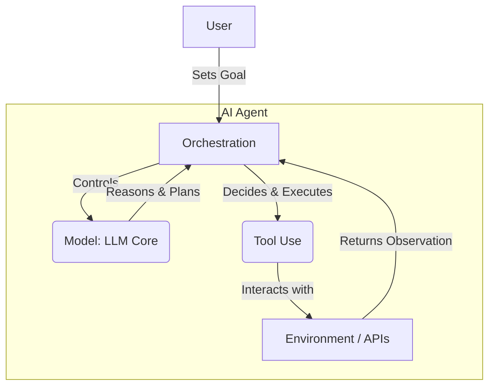

# AI 에이전트 정의 (자율성, 재계획, 툴 사용)

## 1. 핵심 개념 (Core Concept)

AI 에이전트(AI Agent)는 특정 목표(Goal)를 달성하기 위해 환경과 상호작용하며, **자율적으로(Autonomously)** 판단하고 행동하는 시스템임. 단순한 챗봇이나 LLM을 넘어, LLM을 핵심 두뇌로 삼아 **계획(Planning)**하고, 외부 **툴(Tool)**을 사용하여 정보를 수집하거나 과업을 수행하며, 예상치 못한 결과에 직면했을 때 스스로 **재계획(Replan)**하여 문제를 해결해나가는 능력을 갖춘 것이 핵심적인 특징임.

---

## 2. 상세 설명 (Detailed Explanation)

AI 에이전트는 다음과 같은 세 가지 핵심 구성 요소가 결합되어 기능함.

### 2.1 AI 에이전트의 핵심 구성 요소

1.  **모델 (Model)**: 에이전트의 핵심 두뇌 역할을 하는 LLM. 사용자의 지시를 이해하고, 논리적으로 추론하며, 계획을 수립하는 등 의사결정의 중심이 됨.
2.  **툴 (Tools)**: 에이전트가 외부 세계와 상호작용할 수 있도록 능력을 확장하는 도구. API, 함수, 데이터베이스, 웹 검색 기능 등이 포함되며, LLM의 한계를 보완함.
3.  **오케스트레이션 (Orchestration)**: 모델과 툴, 그리고 메모리 등을 연결하여 에이전트의 전체 라이프사이클을 관리하는 로직. 사용자의 입력을 받아 계획을 세우고, 적절한 툴을 호출하며, 그 결과를 바탕으로 다음 행동을 결정하는 순환 과정을 조율함.

### 2.2 자율성과 재계획 (Autonomy & Replanning)

에이전트는 사용자의 개입을 최소화하면서 목표를 향해 독립적으로 작업을 수행함. 사용자가 "다음 주 뉴욕행 항공편을 예약해줘"라고 목표를 부여하면, 에이전트는 항공편 검색, 가격 비교, 최적의 항공편 선택, 예약 확정 등의 모든 하위 작업을 스스로 결정하고 실행함.

특히 중요한 것은 **재계획 및 자기 수정(Replanning & Self-Correction)** 능력임. 계획대로 일이 진행되지 않았을 때(예: API 오류, 검색 결과 없음), 에이전트는 상황을 분석하고 대안을 찾아 스스로 계획을 수정함.

### 2.3 툴 사용 및 설계 (Tool Use & Design)

에이전트의 성능은 툴의 설계에 크게 좌우됨. 이는 단순히 툴을 제공하는 것을 넘어, 모델이 툴을 명확하게 이해하고 쉽게 사용할 수 있도록 인터페이스를 설계하는 **에이전트-컴퓨터 인터페이스(ACI, Agent-Computer Interface)** 개념과 연결됨.

*   **명확한 설명**: 각 툴의 기능, 파라미터, 사용 예시를 명확하고 상세하게 설명해야 함. 모델이 언제, 어떻게 이 툴을 사용해야 할지 쉽게 판단할 수 있어야 함.
*   **단순한 파라미터**: 모델이 사용하기 어려운 복잡한 형식(예: 긴 코드의 JSON 내 문자열 이스케이프 처리) 대신, 자연스럽고 간단한 형식의 파라미터를 사용해야 함.
*   **오류 방지 설계 (Poka-Yoke)**: 모델이 실수하기 어려운 방식으로 툴의 인자를 설계해야 함. 예를 들어, 상대 경로 대신 항상 절대 경로를 사용하도록 강제하여 위치에 따른 오류를 원천적으로 방지할 수 있음.

---

## 3. 예시 (Example)

### 사용 사례: 여행 계획 에이전트

*   **목표**: "다음 주 월요일에 서울에서 출발해서 샌프란시스코로 가는 가장 저렴한 항공편을 찾고, 결과를 이메일로 보내줘."

1.  **계획**: 에이전트는 목표를 달성하기 위해 `search_flights` 툴과 `send_email` 툴이 필요하다고 판단함.
2.  **툴 사용 (1차)**: `search_flights(origin="ICN", destination="SFO", date="2025-07-14")`를 호출함.
3.  **관찰 및 재계획**: 항공편 검색 결과, 직항이 너무 비싸다는 것을 발견함. 에이전트는 비용을 줄이기 위해 경유 항공편도 포함하여 다시 검색하기로 **재계획**함.
4.  **툴 사용 (2차)**: `search_flights(origin="ICN", destination="SFO", date="2025-07-14", include_layover=True)`를 호출함.
5.  **관찰**: 가장 저렴한 경유 항공편 정보를 성공적으로 찾음.
6.  **툴 사용 (3차)**: `send_email(to="user@example.com", subject="항공편 검색 결과", body="...")`를 호출하여 최종 결과를 사용자에게 전달하고 임무를 완수함.

---

## 4. 예상 면접 질문 (Potential Interview Questions)

*   **Q. AI 에이전트의 세 가지 핵심 구성요소는 무엇인가요?**
    *   **A.** 모델, 툴, 오케스트레이션입니다. **모델**은 추론과 계획을 담당하는 LLM 두뇌, **툴**은 외부와 상호작용하는 능력의 확장, **오케스트레이션**은 이 둘을 연결하고 전체 작업 흐름을 관리하는 로직입니다.

*   **Q. 좋은 에이전트 툴을 설계하기 위한 원칙은 무엇인가요?**
    *   **A.** 명확성, 단순성, 오류 방지 설계가 중요합니다. 툴의 기능과 사용법을 명확히 문서화하고, 모델이 사용하기 쉬운 단순한 형태의 파라미터를 제공하며, 모델이 실수할 가능성이 적은 방식으로 툴의 인터페이스를 설계해야 합니다.

*   **Q. 에이전트가 '재계획'을 하는 시나리오의 예를 들어 설명해주세요.**
    *   **A.** 예를 들어, 특정 상품의 재고를 확인하기 위해 `check_inventory(item_id=123)` API를 호출했는데, API 서버의 일시적인 오류로 실패(500 에러)했다고 가정해봅시다. 이때 에이전트는 단순히 실패했다고 보고하는 대신, 오류를 인지하고 잠시 후 다시 시도하거나, `web_search(product_name="상품 123 재고")`와 같은 대체 툴을 사용하여 다른 경로로 정보를 얻으려는 재계획을 세울 수 있습니다.

---

## 5. 더 읽어보기 (Further Reading)

*   [LLM Powered Autonomous Agents (Lilian Weng)](https://lilianweng.github.io/posts/2023-06-23-agent/)
*   [LangChain Agents Documentation](https://python.langchain.com/docs/modules/agents/)
*   [Building LLM applications for production (Chip Huyen)](https://huyenchip.com/2023/08/11/llm-stack.html#agentic_applications)
*   [Google Agent Document](https://www.kaggle.com/whitepaper-agent-companion)
*   [Anthropic Agent Document](https://www.anthropic.com/engineering/building-effective-agents)