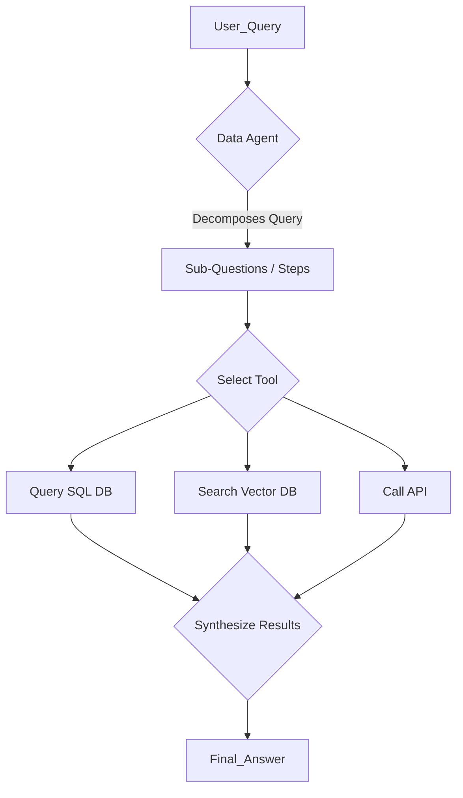

# LlamaIndex (gpt_index)

## 1. 핵심 개념 (Core Concept)

**LlamaIndex**는 LLM이 외부의 사적인(private) 또는 도메인 특화적인(domain-specific) 데이터와 상호작용할 수 있도록 돕는 데이터 프레임워크임. 초기에는 **RAG(검색 증강 생성)** 파이프라인 구축에 중점을 두었으나, 현재는 데이터 소스를 지능적으로 쿼리하고 상호작용하는 **데이터 에이전트(Data Agent)** 기능까지 확장됨. 이를 통해 LLM이 단순히 데이터를 검색하는 것을 넘어, 구조화된 데이터와 비구조화된 데이터를 넘나들며 복잡한 질문에 답할 수 있게 함.

---

## 2. 상세 설명 (Detailed Explanation)

### 2.1 데이터 중심의 LLM 애플리케이션

LlamaIndex의 핵심 철학은 LLM 애플리케이션의 성능이 모델 자체뿐만 아니라, 모델이 활용하는 데이터의 품질과 접근 방식에 달려있다는 것임. 이를 위해 데이터 수집(Ingestion), 인덱싱(Indexing), 쿼리(Querying)의 세 단계를 중심으로 기능을 제공함.

*   **데이터 커넥터 (Data Connectors)**: PDF, API, 데이터베이스 등 다양한 소스로부터 데이터를 쉽게 가져올 수 있음.
*   **인덱스 (Indexes)**: 가져온 데이터를 LLM이 효율적으로 사용할 수 있는 구조(예: 벡터 인덱스, 키워드 테이블 인덱스)로 변환하여 저장함.
*   **쿼리 엔진 (Query Engines)**: 인덱싱된 데이터를 바탕으로 사용자의 질문에 가장 관련성 높은 정보를 찾아 LLM에게 전달하고, 최종 답변을 생성함.

### 2.2 데이터 에이전트: RAG의 진화

단순한 RAG는 사용자의 질문을 기반으로 한 번의 검색을 수행하지만, LlamaIndex의 데이터 에이전트는 더 동적이고 지능적인 데이터 상호작용을 수행함. 이는 Google이 제시한 **Agentic RAG** 개념과 일치하며, 다음과 같은 특징을 가짐.

*   **자동화된 툴 선택**: 에이전트는 사용자의 질문을 분석하여, 여러 개의 데이터 소스(툴) 중에서 어떤 것을 사용할지 스스로 결정함. 예를 들어, 질문에 따라 벡터 데이터베이스를 검색할지, SQL 데이터베이스에 쿼리를 날릴지, 아니면 API를 호출할지를 판단함.
*   **멀티-스텝 쿼리 (Multi-Step Querying)**: 복잡한 질문을 해결하기 위해 여러 단계를 거쳐 추론함. 첫 번째 툴에서 얻은 결과를 바탕으로 두 번째 툴에 필요한 쿼리를 생성하는 등, 점진적으로 문제에 접근함.

이러한 접근 방식은 정형 데이터와 비정형 데이터를 모두 활용해야 하는 복잡한 분석 작업에 특히 유용함.

---

## 3. 예시 (Example)

### 사용 사례: 재무 분석 에이전트

*   **목표**: "지난 분기 우리 회사의 최고 매출 제품은 무엇이고, 해당 제품에 대한 최근 고객 리뷰는 어떤가요?"

1.  **에이전트 계획**: 이 질문을 해결하려면 두 가지 정보 소스가 필요하다고 판단함.
    *   매출 데이터는 사내 SQL 데이터베이스에 있음.
    *   고객 리뷰는 외부 웹사이트(API 호출) 또는 내부 문서(벡터 검색)에 있음.
2.  **실행 1 (SQL 툴)**: 에이전트는 "지난 분기 최고 매출 제품"을 찾기 위해 `sql_query_tool("SELECT product_name, SUM(sales) FROM sales_data WHERE quarter='Q2' GROUP BY product_name ORDER BY SUM(sales) DESC LIMIT 1")`와 같은 쿼리를 생성하여 실행함.
3.  **실행 2 (검색 툴)**: SQL 쿼리 결과로 'Quantum Widget'이라는 제품명을 얻음. 이제 이 제품명을 키워드로 `vector_search_tool("Quantum Widget customer reviews")`를 실행하여 관련 리뷰 문서를 찾음.
4.  **결과 종합**: 에이전트는 두 툴에서 얻은 결과를 종합하여, "지난 분기 최고 매출 제품은 Quantum Widget이며, 고객들은 주로 내구성과 디자인에 만족했지만, 가격이 비싸다는 의견이 있었습니다."와 같은 최종 답변을 생성함.

---

## 4. 예상 면접 질문 (Potential Interview Questions)

*   **Q. LlamaIndex와 LangChain의 주요 차이점은 무엇인가요?**
    *   **A.** LlamaIndex는 LLM이 외부 데이터와 상호작용하는 것, 특히 RAG 파이프라인을 구축하고 최적화하는 데 더 중점을 둡니다. 반면, LangChain은 LLM 애플리케이션 개발을 위한 더 범용적인 프레임워크로, 에이전트, 체인, 프롬프트 등 더 넓은 범위의 구성 요소를 제공합니다. 최근에는 두 프레임워크의 기능이 서로 융합되는 추세이지만, 시작점과 핵심 철학에서 차이가 있습니다.

*   **Q. LlamaIndex의 데이터 에이전트는 기존의 RAG와 어떻게 다른가요?**
    *   **A.** 기존 RAG는 보통 단일 데이터 소스에 대해 한 번의 검색을 수행하는 정적인 파이프라인입니다. 반면, LlamaIndex의 데이터 에이전트는 여러 데이터 소스(툴) 중에서 동적으로 최적의 툴을 선택하고, 복잡한 문제를 해결하기 위해 여러 단계에 걸쳐 쿼리를 수행하는 등 훨씬 더 지능적이고 자율적인 데이터 상호작용을 수행합니다. 이는 Google의 'Agentic RAG' 개념과 유사합니다.

*   **Q. LlamaIndex를 사용하여 RAG 시스템의 성능을 개선할 수 있는 방법은 무엇인가요?**
    *   **A.** (Google 문서 참조) LlamaIndex는 데이터 처리의 여러 단계에서 성능 개선을 지원합니다. 데이터 수집 단계에서는 문서 구조를 잘 파싱하고 의미 단위로 청킹(chunking)할 수 있습니다. 인덱싱 단계에서는 메타데이터를 추가하거나 임베딩 모델을 파인튜닝하여 검색 정확도를 높일 수 있습니다. 쿼리 단계에서는 더 정교한 검색 기법을 사용하거나, 여러 검색 결과를 다시 순위 매기는 재순위화(re-ranking) 모델을 추가하여 최종 결과의 질을 높일 수 있습니다.

---

## 5. 더 읽어보기 (Further Reading)

*   [LlamaIndex Official Documentation](https://docs.llamaindex.ai/en/stable/)
*   [What is RAG? by LlamaIndex](https://www.llamaindex.ai/blog/what-is-rag)
*   [Google Agent Document](https://www.kaggle.com/whitepaper-agent-companion)
*   [Anthropic Agent Document](https://www.anthropic.com/engineering/building-effective-agents)