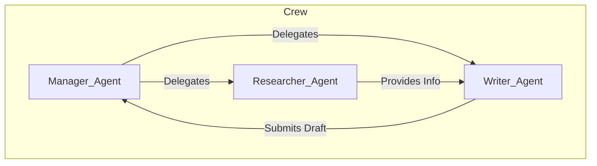

# Semantic Kernel, Marvin, CrewAI

## 1. 핵심 개념 (Core Concept)

**Semantic Kernel**은 Microsoft에서 개발한 경량급 SDK로, 기존 프로그래밍 언어(C#, Python 등)와 LLM을 손쉽게 통합하여 엔터프라이즈급 에이전트를 구축하는 데 중점을 둠. **Marvin**은 Pydantic 모델을 활용하여 LLM의 출력을 안정적인 구조화된 데이터로 변환하는 데 특화된 라이브러리임. **CrewAI**는 자율적인 에이전트들이 서로 협력하여 복잡한 작업을 수행하는 '멀티-에이전트 시스템'을 쉽게 구현할 수 있도록 설계된 프레임워크임.

---

## 2. 상세 설명 (Detailed Explanation)

### 2.1 Semantic Kernel: 엔터프라이즈용 LLM 오케스트레이터

Semantic Kernel은 LLM을 기존의 복잡한 기업 시스템 및 코드베이스에 통합하는 것을 목표로 함. 핵심 아이디어는 LLM의 'Semantic Function'과 기존 코드의 'Native Function'을 동일한 방식으로 호출하고 조합(Chaining)하는 것임.

*   **플래너 (Planner)**: 사용자의 목표를 달성하기 위해 등록된 여러 함수(Semantic/Native)들을 어떤 순서로 호출할지 동적으로 계획을 생성함. (예: 이메일에서 사용자 의도를 파악(Semantic) -> CRM 시스템에서 고객 정보 조회(Native) -> 답변 초안 생성(Semantic))
*   **커넥터 (Connectors)**: 다양한 LLM 모델, 벡터 데이터베이스, 외부 서비스와의 연결을 쉽게 확장할 수 있도록 지원함.
*   **장점**: Microsoft 생태계(Azure, Office 365)와의 강력한 통합을 제공하며, 엔터프라이즈 환경에서 요구되는 보안 및 안정성을 고려하여 설계됨.

### 2.2 Marvin: LLM 출력을 위한 안정적인 가드레일

LLM은 종종 비정형 텍스트를 생성하여 파싱하기 어렵거나, 지시를 따르지 않는 경우가 있음. Marvin은 Python의 데이터 유효성 검사 라이브러리인 Pydantic을 사용하여 이 문제를 해결함.

*   **작동 방식**: 개발자가 원하는 출력 형태를 Pydantic 모델로 정의하면, Marvin은 LLM의 출력이 이 모델의 스키마를 정확히 따르도록 내부적으로 프롬프팅하고 유효성을 검사함.
*   **주요 기능**:
    *   `marvin.classify`: 텍스트를 정의된 Enum 카테고리로 분류.
    *   `marvin.extract`: 텍스트에서 정의된 Pydantic 모델에 맞는 정보를 추출.
    *   `marvin.generate`: 특정 형식에 맞는 데이터를 생성.
*   **장점**: LLM의 출력을 안정적이고 예측 가능한 구조화된 데이터로 만들 수 있어, 후속 처리나 데이터베이스 저장 시 매우 유용함.

### 2.3 CrewAI: 협업을 통한 문제 해결

CrewAI는 복잡한 문제를 해결하기 위해 여러 명의 전문가가 팀을 이루어 협력하는 현실 세계의 모습을 에이전트로 구현함. 이는 Google의 "Agents Companions V2"에서 설명하는 **다중 에이전트 아키텍처(Multi-Agent Architecture)**를 쉽게 구축할 수 있도록 도와줌.

*   **핵심 구성 요소**:
    *   **Agents**: 특정 역할(Role), 목표(Goal), 배경 이야기(Backstory)를 가진 개별 에이전트. (예: '리서처', '작성자')
    *   **Tasks**: 각 에이전트가 수행해야 할 구체적인 임무.
    *   **Tools**: 에이전트들이 사용할 수 있는 도구.
    *   **Crew**: 에이전트, 태스크, 프로세스를 정의하고 전체 작업을 조율함.
*   **프로세스**: 순차적(Sequential) 프로세스와 계층적(Hierarchical) 프로세스를 지원하여, 에이전트 간의 작업 흐름을 제어할 수 있음.

---

## 3. 예시 (Example)

### 사용 사례: 시장 분석 보고서 작성 (CrewAI 활용)

*   **목표**: "AI 기술이 헬스케어 산업에 미치는 영향에 대한 블로그 포스트 작성"

1.  **에이전트 정의**:
    *   **Senior Researcher**: AI와 헬스케어 관련 최신 뉴스와 논문을 검색하는 역할.
    *   **Content Writer**: 검색된 정보를 바탕으로 블로그 포스트 초안을 작성하는 역할.
    *   **Chief Editor**: 초안을 검토하고, 문법과 스타일을 교정하여 최종본을 만드는 역할.
2.  **태스크 정의**:
    *   **Task 1 (Researcher)**: "AI 기반 진단, 신약 개발, 원격 의료 분야의 최신 동향을 조사하라."
    *   **Task 2 (Writer)**: "조사된 내용을 바탕으로 1000자 내외의 블로그 포스트 초안을 작성하라."
    *   **Task 3 (Editor)**: "초안의 내용이 명확하고, 독자가 이해하기 쉬운지 검토하고 수정하라."
3.  **크루 실행**: CrewAI는 정의된 순서(또는 계층 구조)에 따라 각 에이전트에게 태스크를 할당하고 실행함. Researcher의 결과가 Writer에게 전달되고, Writer의 결과가 Editor에게 전달되어 최종 결과물이 완성됨.

---

## 4. 예상 면접 질문 (Potential Interview Questions)

*   **Q. CrewAI와 LangGraph는 둘 다 다중 에이전트 시스템을 만드는 데 사용될 수 있습니다. 두 프레임워크의 접근 방식에 어떤 차이가 있나요?**
    *   **A.** LangGraph는 상태 그래프(State Graph)를 통해 노드와 엣지를 직접 정의하며, 매우 유연하고 세밀한 제어가 가능한 로우-레벨(low-level) 접근 방식을 취합니다. 반면, CrewAI는 '역할', '임무' 등 더 추상화된 개념을 사용하여 에이전트 간의 협업을 정의하는 하이-레벨(high-level) 접근 방식을 취합니다. 따라서 복잡한 상호작용을 세밀하게 제어하고 싶다면 LangGraph가, 일반적인 협업 패턴을 빠르게 구현하고 싶다면 CrewAI가 더 적합할 수 있습니다.

*   **Q. LLM의 출력을 처리할 때 Marvin과 같은 라이브러리를 사용하는 것이 왜 중요한가요?**
    *   **A.** LLM의 출력은 비정형적이고 예측 불가능할 수 있기 때문에, 이를 그대로 후속 시스템의 입력으로 사용하면 오류가 발생하기 쉽습니다. Marvin은 Pydantic 모델을 통해 LLM의 출력이 항상 일관된 스키마를 따르도록 강제하여 데이터의 신뢰성과 안정성을 높여줍니다. 이는 특히 추출된 정보를 데이터베이스에 저장하거나 다른 API의 입력으로 사용해야 하는 경우에 매우 중요합니다.

*   **Q. Microsoft의 Semantic Kernel이 '엔터프라이즈' 환경에 적합하다고 하는 이유는 무엇일까요?**
    *   **A.** Semantic Kernel은 기존의 방대한 C#이나 Python 코드베이스와 LLM 기능을 자연스럽게 통합하는 데 중점을 두고 설계되었기 때문입니다. Native Function과 Semantic Function을 동등하게 취급하고, 플래너를 통해 이를 동적으로 조합하는 방식은 복잡한 비즈니스 로직을 가진 기업 시스템에 LLM을 점진적으로 도입하기에 용이합니다. 또한 Microsoft 생태계와의 강력한 연동성도 큰 장점입니다.

---

## 5. 더 읽어보기 (Further Reading)

*   [Microsoft Semantic Kernel Documentation](https://learn.microsoft.com/en-us/semantic-kernel/overview/)
*   [Marvin by Pydantic](https://www.askmarvin.ai/)
*   [CrewAI Documentation](https://docs.crewai.com/)
*   [Google Agent Document](https://www.kaggle.com/whitepaper-agent-companion)
*   [Anthropic Agent Document](https://www.anthropic.com/engineering/building-effective-agents)