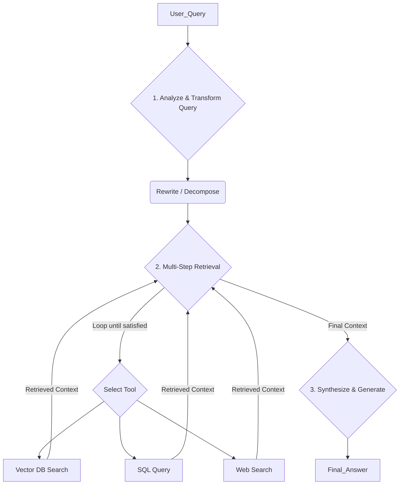

# 고급·Agentic RAG (다중 스텝, 툴 기반 보강)

## 1. 핵심 개념 (Core Concept)

**Agentic RAG**는 전통적인 RAG 파이프라인에 AI 에이전트의 자율적인 추론 및 실행 능력을 결합한 고급 아키텍처임. 단순한 단일 검색-생성 구조를 넘어, 에이전트가 스스로 **쿼리를 분석 및 재작성**하고, **여러 단계에 걸쳐(Multi-Step)** 정보를 탐색하며, 필요에 따라 **다양한 툴(Tool)**을 동적으로 사용하여 지식을 보강함. 이를 통해 복잡하고 모호한 질문에 대해 훨씬 더 깊이 있고 정확한 답변을 생성할 수 있음.

---

## 2. 상세 설명 (Detailed Explanation)

Google과 Anthropic의 문서, 그리고 최신 연구 동향에서 공통적으로 나타나는 Agentic RAG는 기존 RAG의 한계를 극복하기 위해 등장했음. 기존 RAG는 사용자의 초기 질문이 부정확하거나, 여러 정보를 종합해야 하는 경우 최적의 답변을 찾기 어려웠음.

### 2.1 주요 Agentic RAG 패턴

1.  **쿼리 변환 (Query Transformation)**
    *   **쿼리 재작성 (Query Rewriting)**: 사용자의 초기 쿼리가 너무 모호하거나 광범위할 경우, 에이전트가 대화의 맥락을 고려하여 더 구체적이고 검색에 용이한 쿼리로 재작성함.
    *   **하위 질문 분해 (Sub-Question Decomposition)**: 복잡한 질문을 여러 개의 간단한 하위 질문으로 분해하고, 각 하위 질문에 대한 답변을 개별적으로 검색하여 나중에 종합함. (예: "A와 B의 장단점을 비교하고 C와의 관계를 설명해줘" -> 3개의 하위 질문으로 분해)

2.  **멀티-스텝 추론 및 검색 (Multi-Step Reasoning & Retrieval)**
    에이전트는 한 번의 검색으로 끝내는 것이 아니라, 여러 단계를 거치며 점진적으로 정보를 수집하고 답변을 구체화함. 이는 ReAct 프레임워크와 유사하게 작동함.
    *   **Step 1**: 초기 검색 수행.
    *   **Step 2**: 검색 결과를 분석하여 부족한 정보를 파악하고, 이를 보충하기 위한 다음 검색 쿼리를 생성.
    *   **Step 3**: 필요한 모든 정보가 수집될 때까지 이 과정을 반복.

3.  **툴 기반 보강 (Tool-Augmented RAG)**
    에이전트는 벡터 데이터베이스 검색뿐만 아니라, 다양한 툴을 동적으로 활용하여 정보를 보강함.
    *   **구조화된 데이터 접근**: SQL 데이터베이스 쿼리 툴을 사용하여 정형 데이터에 접근.
    *   **최신 정보 접근**: 웹 검색 API(Google Search, Tavily 등)를 사용하여 실시간 정보 확인.
    *   **계산**: 계산기 툴을 사용하여 정확한 수치 계산.

---

## 3. 예시 (Example)

### 사용 사례: 금융 분석가 에이전트

*   **목표**: "최근 실적이 가장 좋았던 기술주(Tech Stock)는 무엇이고, 그 회사의 현재 주가와 최근 분기별 실적을 요약해줘."

1.  **쿼리 분해 (1단계)**: 에이전트는 이 복잡한 질문을 세 개의 하위 질문으로 분해함.
    *   Q1: 최근 실적이 가장 좋았던 기술주는?
    *   Q2: 해당 회사의 현재 주가는?
    *   Q3: 해당 회사의 최근 분기별 실적은?

2.  **멀티-스텝 및 툴 기반 검색 (2단계)**:
    *   **A1 (for Q1)**: 에이전트는 '최근 실적'이라는 모호한 표현을 해석하기 위해 **웹 검색 툴**을 사용하여 최신 시장 분석 보고서를 검색함. -> "QuantumLeap Inc."라는 답을 얻음.
    *   **A2 (for Q2)**: 에이전트는 "QuantumLeap Inc. 주가"를 **금융 API 툴**을 사용하여 실시간으로 조회함.
    *   **A3 (for Q3)**: 에이전트는 회사의 분기별 실적 데이터가 저장된 **SQL 데이터베이스 툴**을 사용하여 관련 재무 데이터를 쿼리함.

3.  **종합 및 생성 (3단계)**: 에이전트는 각 단계에서 수집한 모든 정보(시장 분석, 실시간 주가, 재무 데이터)를 종합하여 사용자에게 완전한 형태의 보고서를 생성하여 전달함.

---

## 4. 예상 면접 질문 (Potential Interview Questions)

*   **Q. Agentic RAG가 전통적인 RAG에 비해 갖는 가장 큰 장점은 무엇인가요?**
    *   **A.** 자율성과 적응성입니다. 전통적인 RAG는 정해진 파이프라인을 따르지만, Agentic RAG는 에이전트가 문제의 복잡성을 스스로 판단하고, 쿼리를 재작성하거나, 여러 단계를 거쳐 탐색하고, 다양한 툴을 동적으로 사용하는 등 문제 해결 전략 자체를 최적화할 수 있습니다. 이로 인해 훨씬 더 복잡하고 미묘한 뉘앙스를 가진 질문에 효과적으로 대응할 수 있습니다.

*   **Q. Agentic RAG에서 '쿼리 변환(Query Transformation)'은 왜 중요한가요?**
    *   **A.** "Garbage in, garbage out" 원칙처럼, 검색의 질은 쿼리의 질에 크게 좌우되기 때문입니다. 사용자의 초기 질문은 종종 모호하거나 여러 질문이 섞여 있을 수 있습니다. 쿼리 변환을 통해 에이전트는 검색 시스템이 가장 잘 이해할 수 있는 명확하고 구체적인 쿼리를 생성하여, 처음부터 관련성 높은 정보를 찾아낼 확률을 극적으로 높입니다.

*   **Q. 멀티-에이전트 시스템과 Agentic RAG는 어떤 관계가 있나요?**
    *   **A.** Agentic RAG는 멀티-에이전트 시스템의 한 형태로 볼 수 있습니다. 예를 들어, 쿼리를 분석하는 '라우터 에이전트', 특정 데이터베이스를 전문으로 검색하는 '검색 에이전트', 그리고 결과를 종합하는 '생성 에이전트' 등 여러 전문 에이전트가 협력하여 RAG 파이프라인을 수행하는 구조로 설계할 수 있습니다. 이처럼 Agentic RAG의 복잡한 워크플로우는 멀티-에이전트 협업 패턴을 통해 효과적으로 구현될 수 있습니다.

---

## 5. 더 읽어보기 (Further Reading)

*   [7 Advanced RAG Techniques by Anyscale](https://www.anyscale.com/blog/a-comprehensive-guide-for-building-rag-with-llms-part-1)
*   [IBM Research: What is Agentic RAG?](https://research.ibm.com/blog/what-is-agentic-rag)
*   [Google Agent Document](https://www.kaggle.com/whitepaper-agent-companion)
*   [Anthropic Agent Document](https://www.anthropic.com/engineering/building-effective-agents)