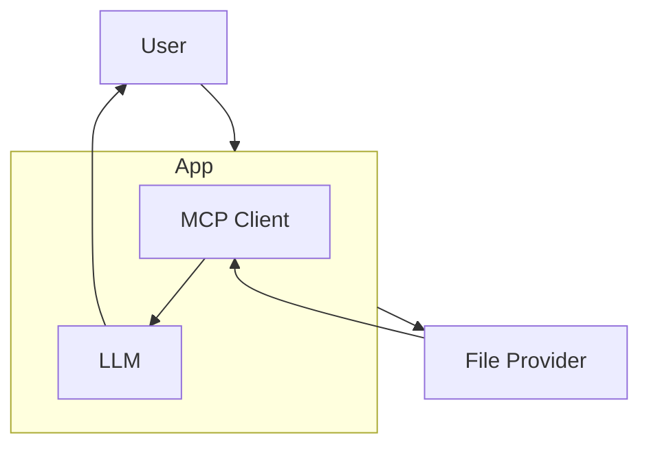

# 모델-컨텍스트-프로토콜 (Model-Context-Protocol)

## 1. 핵심 개념 (Core Concept)

**모델-컨텍스트-프로토콜(Model-Context-Protocol, MCP)**은 Anthropic이 제안한 개방형 표준으로, LLM(모델)이 외부의 컨텍스트 정보(예: 파일, API 결과, 데이터베이스)를 제공하는 **컨텍스트 제공자(Context Provider)**와 상호작용하는 방식을 표준화한 규약임. 개발자가 각기 다른 컨텍스트 소스를 LLM에 연결하기 위해 별도의 코드를 작성할 필요 없이, MCP라는 단일 인터페이스를 통해 다양한 외부 정보를 일관되게 주입할 수 있도록 하는 것을 목표로 함.

---

## 2. 상세 설명 (Detailed Explanation)

Anthropic의 "Building Effective AI Agents" 문서에서 언급된 것처럼, 에이전트의 성능은 LLM에 어떤 정보(컨텍스트)를 증강(augment)하느냐에 크게 좌우됨. 하지만 다양한 소스(로컬 파일, 웹 페이지, Notion, Slack 등)로부터 컨텍스트를 가져오는 로직은 복잡하고 파편화되어 있음.

### 2.1 MCP의 작동 원리

MCP는 이 문제를 해결하기 위해 **클라이언트(Client)**와 **제공자(Provider)** 모델을 사용함.

*   **제공자 (Provider)**: 특정 소스로부터 컨텍스트를 가져오는 역할을 하는 서버 또는 서비스. 예를 들어, `file-provider`는 로컬 파일을, `url-provider`는 웹 페이지 내용을 가져옴.
*   **클라이언트 (Client)**: LLM 애플리케이션에 통합되어, 사용자의 입력에서 특정 URI(Uniform Resource Identifier) 스킴(예: `file://`, `https://`)을 감지하고, 해당 스킴에 맞는 제공자에게 컨텍스트를 요청하는 역할을 함.

### 2.2 주요 특징

*   **URI 기반 라우팅**: 사용자가 프롬프트에 `file:///`이나 `https://` 같은 표준 URI를 포함시키기만 하면, 클라이언트가 이를 자동으로 인식하여 적절한 제공자에게 라우팅함. 이를 통해 사용자는 자연스러운 방식으로 에이전트에게 컨텍스트를 지정해 줄 수 있음.
*   **단순성과 확장성**: 개발자는 새로운 컨텍스트 소스를 지원하기 위해 LLM 애플리케이션 코드를 수정할 필요 없이, 해당 소스에 대한 MCP 제공자만 구현하면 됨. 이는 시스템의 확장성을 크게 높여줌.
*   **보안**: 제공자는 인증 및 권한 부여 로직을 구현하여, 허가된 사용자나 에이전트만 특정 컨텍스트에 접근할 수 있도록 제어할 수 있음.

---

## 3. 예시 (Example)

### 사용 사례: 코드베이스 관련 질의응답 챗봇

*   **상황**: 개발자가 로컬 코드베이스의 특정 파일에 대해 질문하는 시나리오.

1.  **사용자 입력**: 개발자는 챗봇에게 다음과 같이 질문함.
    > "`file:///Users/dev/project/src/main.py` 파일의 주요 기능은 뭐야? 그리고 `https://github.com/some/repo/issues/123` 이 이슈와 관련이 있어?"

2.  **MCP 클라이언트 작동**:
    *   클라이언트는 `file://` URI를 감지하고, 로컬 파일 시스템에 접근하는 `file-provider`를 호출하여 `main.py` 파일의 내용을 가져옴.
    *   동시에 `https://` URI를 감지하고, 웹 페이지 내용을 가져오는 `url-provider`를 호출하여 GitHub 이슈 페이지의 내용을 가져옴.

3.  **프롬프트 구성**: 클라이언트는 가져온 두 컨텍스트(파일 내용, 이슈 내용)를 모두 LLM의 프롬프트에 삽입함.

4.  **LLM 답변 생성**: LLM은 두 가지 정보를 종합하여, "`main.py` 파일은 시스템의 주요 로직을 처리하며, 제공해주신 GitHub 이슈는 해당 파일의 인증 버그와 관련된 것으로 보입니다." 와 같이 깊이 있는 답변을 생성함.

---

## 4. 예상 면접 질문 (Potential Interview Questions)

*   **Q. MCP(모델-컨텍스트-프로토콜)가 해결하려는 핵심 문제는 무엇인가요?**
    *   **A.** LLM 애플리케이션이 다양한 외부 정보 소스(파일, URL, 데이터베이스 등)와 연동할 때 발생하는 코드의 복잡성과 파편화 문제를 해결하려 합니다. 각 소스마다 별도의 연동 로직을 작성하는 대신, MCP라는 표준화된 인터페이스를 통해 어떤 종류의 컨텍스트든 일관된 방식으로 LLM에 주입할 수 있도록 하여 개발을 단순화하고 확장성을 높입니다.

*   **Q. MCP는 RAG(검색 증강 생성)와 어떤 관계가 있나요?**
    *   **A.** MCP는 RAG를 구현하는 한 가지 방법론 또는 RAG의 일부를 표준화한 것으로 볼 수 있습니다. RAG의 '검색(Retrieval)' 단계는 다양한 소스로부터 정보를 가져오는 것을 포함하는데, MCP는 바로 이 부분을 표준화합니다. 사용자가 URI를 통해 명시적으로 컨텍스트를 지정하면, MCP는 해당 컨텍스트를 가져와 LLM에게 전달함으로써 RAG 파이프라인을 완성합니다.

*   **Q. MCP의 '제공자(Provider)'를 직접 구현한다면 어떤 장점이 있을까요?**
    *   **A.** 기업 내부의 독자적인 데이터 소스(예: 사내 Notion, Jira, 자체 데이터베이스)를 LLM 애플리케이션에 쉽게 통합할 수 있습니다. 해당 데이터 소스에 접근하는 로직을 가진 MCP 제공자만 한 번 구현해두면, 모든 LLM 애플리케이션이 별도의 수정 없이 표준 URI를 통해 해당 내부 데이터에 안전하게 접근하고 활용할 수 있게 됩니다.

---

## 5. 더 읽어보기 (Further Reading)

*   [Model-Context-Protocol Official Site](https://modelcontextprotocol.io/)
*   [Anthropic's Introduction to MCP](https://www.anthropic.com/news/model-context-protocol)
*   [Anthropic Agent Document](https://www.anthropic.com/engineering/building-effective-agents)