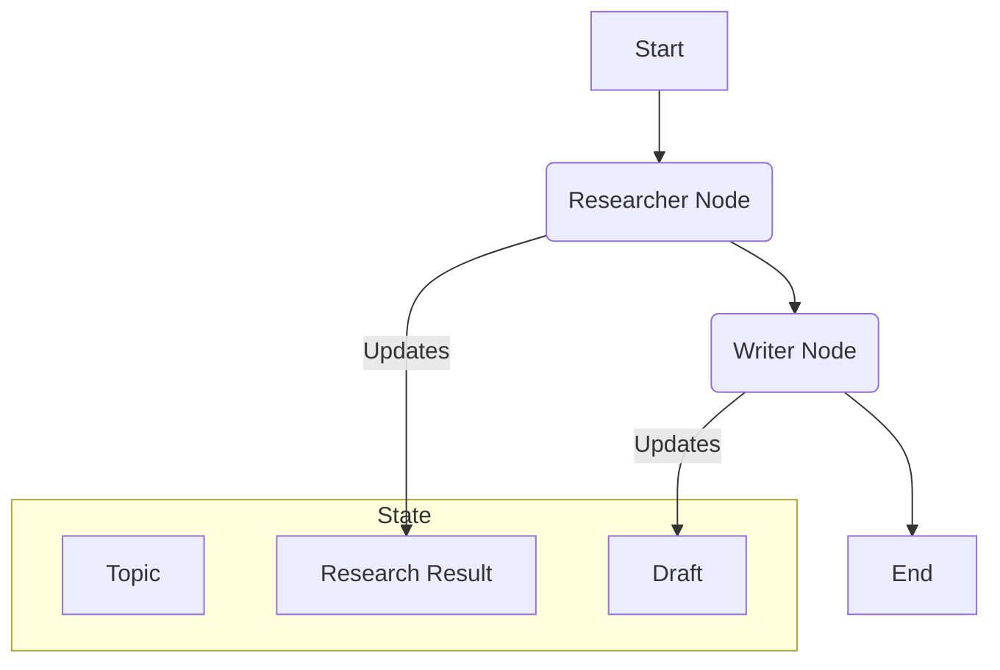

# 멀티 에이전트 워크플로우 예제 (LangGraph)

## 1. 핵심 개념 (Core Concept)

이 플레이북은 LangGraph를 사용하여 여러 AI 에이전트가 협력하는 워크플로우를 구축하는 방법을 안내함. 구체적으로, 하나의 주제에 대해 `리서처(Researcher)` 에이전트가 웹 검색을 통해 정보를 수집하면, `작성자(Writer)` 에이전트가 그 정보를 바탕으로 블로그 초안을 작성하는 간단한 **순차적(Sequential)** 협업 패턴을 구현함. 이는 복잡한 멀티-에이전트 시스템의 가장 기본적인 구성 요소를 이해하는 데 도움을 줌.

---

## 2. 상세 설명 (Detailed Explanation)

### 2.1 멀티-에이전트 워크플로우 설계

Anthropic과 Google의 문서에서 공통적으로 강조하듯, 복잡한 작업은 각기 다른 전문성을 가진 여러 에이전트에게 나누어 처리하게 하는 것이 효과적임. LangGraph는 이러한 협업 흐름을 상태 그래프(State Graph)로 모델링함.

1.  **상태 정의 (Define State)**: 워크플로우 전체에서 공유될 데이터 구조를 정의함. 각 에이전트는 이 상태 객체를 읽고 자신의 작업 결과를 기록함.
2.  **노드 정의 (Define Nodes)**: 각 에이전트의 역할을 수행하는 Python 함수를 그래프의 노드(Node)로 정의함. 각 노드는 상태 객체를 입력으로 받아 일부를 수정한 뒤 반환함.
3.  **엣지 연결 (Connect Edges)**: 노드 간의 작업 흐름을 엣지(Edge)로 연결함. 단순한 순차 실행부터, 특정 조건에 따라 다음 노드를 결정하는 조건부 엣지까지 다양하게 설정할 수 있음.



---

## 3. 예시 (Example)

### 코드 예시 (Python)

이 코드를 실행하려면 `langgraph`, `langchain`, `langchain_openai`, `tavily-python` 라이브러리가 설치되어 있어야 함. `OPENAI_API_KEY`와 `TAVILY_API_KEY` 환경 변수 설정도 필요함.

```python
import os
from typing import List, TypedDict

from langchain_core.messages import BaseMessage, HumanMessage
from langchain_core.prompts import ChatPromptTemplate
from langchain_openai import ChatOpenAI
from langgraph.graph import END, StateGraph
from langchain_community.tools.tavily_search import TavilySearchResults

# --- 1. 환경 설정 ---
# os.environ["OPENAI_API_KEY"] = "YOUR_OPENAI_API_KEY"
# os.environ["TAVILY_API_KEY"] = "YOUR_TAVILY_API_KEY"

# --- 2. 툴 정의 ---
# 리서처 에이전트가 사용할 웹 검색 툴
tools = [TavilySearchResults(max_results=3)]

# --- 3. 상태(State) 정의 ---
# 워크플로우 전체에서 공유될 데이터 구조
class AgentState(TypedDict):
    messages: List[BaseMessage]

# --- 4. 에이전트(노드) 정의 ---

# LLM 모델 초기화
model = ChatOpenAI(temperature=0, streaming=True)

# 리서처 에이전트: 모델과 툴을 바인딩
researcher_model = model.bind_tools(tools)

# 리서처 노드 함수
def researcher_node(state: AgentState):
    print("--- 리서처 노드 실행 ---")
    # 사용자의 마지막 메시지를 받아 툴을 호출하고 결과를 반환
    response = researcher_model.invoke(state["messages"])
    return {"messages": [response]}

# 작성자 노드 함수
def writer_node(state: AgentState):
    print("--- 작성자 노드 실행 ---")
    # 리서처의 결과(state['messages'][-1])를 바탕으로 글을 작성
    prompt = ChatPromptTemplate.from_messages([
        ("system", "You are a professional tech blog writer. Write a concise blog post based on the provided research content."),
        ("user", "{research_summary}")
    ])
    writer_chain = prompt | model
    # state['messages'][-1].tool_calls는 리서처가 호출한 툴의 결과임
    research_summary = "\n".join([str(call) for call in state["messages"][-1].tool_calls])
    response = writer_chain.invoke({"research_summary": research_summary})
    return {"messages": [response]}

# --- 5. 그래프(Graph) 생성 및 엣지 연결 ---
workflow = StateGraph(AgentState)

# 노드 추가
workflow.add_node("researcher", researcher_node)
workflow.add_node("writer", writer_node)

# 엣지 연결
workflow.set_entry_point("researcher")
workflow.add_edge("researcher", "writer")
workflow.add_edge("writer", END)

# 그래프 컴파일
app = workflow.compile()

# --- 6. 워크플로우 실행 ---
initial_state = {"messages": [HumanMessage(content="What is the latest news on AI agents in 2025?")]}
final_state = app.invoke(initial_state)

print("\n--- 최종 결과 ---")
print(final_state['messages'][-1].content)
```

### 실행 결과 (예시)

```
---
--- 작성자 노드 실행 ---

--- 최종 결과 ---
**2025년, AI 에이전트의 새로운 지평이 열리다**

2025년 인공지능(AI) 분야의 가장 뜨거운 화두는 단연 'AI 에이전트'입니다. 최근 발표된 연구에 따르면, AI 에이전트는 이제 단순한 챗봇을 넘어, 자율적으로 작업을 계획하고 다양한 툴을 사용하여 복잡한 문제를 해결하는 단계로 진화하고 있습니다. 특히, 여러 에이전트가 협력하는 멀티-에이전트 시스템이 주목받고 있으며, 이는 소프트웨어 개발, 고객 지원, 과학 연구 등 다양한 분야에서 인간의 생산성을 극대화할 잠재력을 보여주고 있습니다. ... (이하 생략)
```

---

## 4. 예상 면접 질문 (Potential Interview Questions)

*   **Q. 위 코드에서 `AgentState`는 어떤 역할을 하며, 왜 중요한가요?**
    *   **A.** `AgentState`는 워크플로우의 모든 노드(에이전트)가 공유하는 중앙 데이터 저장소 역할을 합니다. 리서처 에이전트가 작업한 결과를 상태에 저장하면, 다음 단계인 작성자 에이전트가 그 결과를 읽어 자신의 작업을 수행할 수 있습니다. 이처럼 상태를 통해 노드 간에 정보를 전달하므로, 멀티-에이전트 워크플로우를 구성하는 데 핵심적인 요소입니다.

*   **Q. 이 워크플로우를 '평가자-최적화' 패턴으로 개선하려면 어떻게 해야 할까요?**
    *   **A.** `writer` 노드 다음에 `editor` 노드를 추가하고, `editor`는 `writer`가 작성한 초안을 평가하고 피드백을 생성하도록 합니다. 그리고 `writer`와 `editor` 사이에 조건부 엣지(Conditional Edge)를 추가합니다. `editor`의 피드백이 있으면 다시 `writer` 노드로 돌아가 글을 수정하게 하고, 피드백이 없으면(완벽하면) 워크플로우를 종료하도록 만들 수 있습니다. 이 순환 구조를 통해 결과물의 품질을 점진적으로 높일 수 있습니다.

*   **Q. LangGraph와 같은 프레임워크 없이 멀티-에이전트 시스템을 직접 구현한다면 어떤 점이 가장 어려울까요?**
    *   **A.** 상태 관리와 제어 흐름(Control Flow)을 직접 구현하는 것이 가장 어렵습니다. 여러 에이전트의 작업 상태를 추적하고, 한 에이전트의 결과를 다음 에이전트에게 안정적으로 전달하며, 조건에 따라 작업 흐름을 분기하거나 반복하는 로직을 모두 직접 코드로 작성해야 합니다. LangGraph는 이러한 복잡한 오케스트레이션 로직을 그래프 구조로 추상화하여 개발자가 각 에이전트의 핵심 기능에만 집중할 수 있도록 도와줍니다.

---

## 5. 더 읽어보기 (Further Reading)

*   [LangGraph Documentation](https://langchain-ai.github.io/langgraph/)
*   [Google Agent Document (Multi-Agent Design Patterns)](https://www.kaggle.com/whitepaper-agent-companion)
*   [Anthropic Agent Document (Orchestrator-workers)](https://www.anthropic.com/engineering/building-effective-agents)