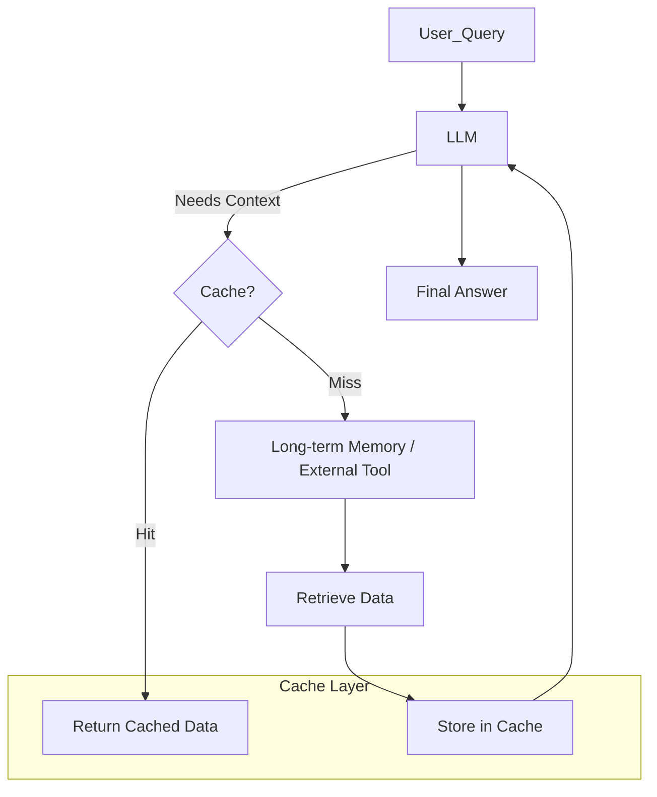

# 스토리지 & 캐시 전략 (Storage & Caching Strategies)

## 1. 핵심 개념 (Core Concept)

AI 에이전트 시스템에서 **스토리지(Storage)**와 **캐시(Caching)** 전략은 에이전트의 성능, 비용 효율성, 그리고 장기적인 학습 능력을 결정하는 핵심 요소임. 에이전트가 과거의 대화, 학습 경험, 툴 사용 결과 등 다양한 정보를 효율적으로 저장하고 필요할 때 빠르게 접근할 수 있도록, 데이터의 특성과 접근 빈도에 따라 적절한 저장 매체와 캐싱 계층을 설계하는 것이 중요함. 이는 LLM의 컨텍스트 창 한계를 극복하고, 불필요한 LLM 호출을 줄여 비용을 절감하는 데 기여함.

---

## 2. 상세 설명 (Detailed Explanation)

에이전트의 메모리(단기/장기)는 실제 스토리지 및 캐싱 전략을 통해 구현됨. Google의 "Agents Companions V2" 문서에서 언급된 것처럼, 메모리 관리는 에이전트의 자율적인 작동에 필수적인 요소임.

### 2.1 메모리 계층 구조

컴퓨터 시스템의 메모리 계층 구조와 유사하게, 에이전트의 메모리도 접근 속도와 비용에 따라 여러 계층으로 나눌 수 있음.

1.  **컨텍스트 창 (Context Window)**: LLM의 입력으로 직접 들어가는 가장 빠르고 비싼 메모리. 현재 대화의 가장 중요한 부분이나 즉각적인 추론에 필요한 정보를 저장함.
2.  **단기 기억 (Short-term Memory)**: 현재 세션 내에서만 유효한 정보. 대화 기록 전체, 최근 툴 호출 결과 등을 저장하며, 컨텍스트 창에 들어가지 못하는 과거 대화는 요약되거나 압축될 수 있음.
    *   **구현**: Redis, Memcached와 같은 인메모리(in-memory) 데이터베이스나, 세션 스토리지.
3.  **장기 기억 (Long-term Memory)**: 여러 세션에 걸쳐 영구적으로 보존되어야 하는 정보. 사용자 프로필, 학습된 지식, 과거의 성공/실패 경험, 자주 사용하는 정보 등을 저장함.
    *   **구현**: 벡터 데이터베이스(Vector DB), 관계형 데이터베이스(RDBMS), 그래프 데이터베이스(Graph DB), 클라우드 스토리지(S3, GCS) 등.

### 2.2 캐싱 전략

캐싱은 자주 접근하는 데이터를 더 빠르고 저렴한 저장소에 임시로 보관하여, 반복적인 계산이나 외부 API 호출을 줄이는 전략임.

1.  **LLM 응답 캐싱**: 동일한 프롬프트에 대한 LLM의 응답을 캐시하여, 불필요한 LLM 호출을 줄임. 특히 비용이 비싼 LLM API 사용량을 절감하는 데 효과적임.
2.  **툴 호출 결과 캐싱**: 웹 검색, 데이터베이스 쿼리 등 툴 호출의 결과를 캐시하여, 동일한 쿼리에 대한 반복적인 외부 호출을 방지함.
3.  **RAG 캐싱 (Retrieval Cache)**: RAG 시스템에서 검색된 문서(청크)를 캐시하여, 동일한 쿼리에 대한 벡터 DB 검색을 줄임. 특히 자주 묻는 질문에 대한 응답 속도를 높이는 데 유용함.
4.  **KV 캐시 (Key-Value Cache)**: LLM 추론 과정에서 생성되는 Key와 Value 벡터를 캐시하여, 다음 토큰 생성 시 재사용함으로써 추론 속도를 높이고 메모리 사용량을 최적화함. (vLLM의 PagedAttention 등)

---

## 3. 예시 (Example)

### 사용 사례: 뉴스 요약 에이전트

*   **목표**: 사용자가 특정 주제에 대한 뉴스 요약을 요청하면, 최신 뉴스를 검색하여 요약하고, 이전에 요약했던 내용은 캐시에서 제공.

1.  **사용자 요청**: "오늘의 AI 기술 동향 뉴스 요약해줘."
2.  **캐시 확인**: 에이전트는 먼저 'AI 기술 동향'에 대한 요약이 캐시되어 있는지 확인.
    *   **캐시 히트**: 캐시된 요약이 있다면 즉시 반환. (비용 0, 지연 시간 최소화)
    *   **캐시 미스**: 캐시된 요약이 없다면 다음 단계로 진행.
3.  **웹 검색 (툴 호출)**: `web_search_tool("latest AI tech trends news")`를 호출하여 최신 뉴스 기사 목록을 가져옴.
4.  **뉴스 기사 내용 가져오기**: 각 기사의 URL을 `read_url_tool`로 호출하여 내용을 가져옴. (이 단계에서도 URL별 캐싱 적용 가능)
5.  **LLM 요약**: 가져온 뉴스 기사 내용을 LLM에 전달하여 요약문을 생성.
6.  **캐시 저장**: 생성된 요약문을 캐시에 저장하고, 사용자에게 반환.

---

## 4. 예상 면접 질문 (Potential Interview Questions)

*   **Q. 에이전트 시스템에서 캐싱 전략이 왜 중요한가요?**
    *   **A.** 캐싱은 에이전트 시스템의 성능과 비용 효율성을 크게 향상시킵니다. LLM 호출이나 외부 툴 호출은 비용이 발생하고 지연 시간이 길 수 있습니다. 자주 요청되는 정보나 반복적인 계산 결과를 캐시함으로써, 불필요한 호출을 줄여 응답 속도를 높이고 운영 비용을 절감할 수 있습니다.

*   **Q. LLM의 컨텍스트 창 한계를 극복하기 위해 캐싱 외에 어떤 전략을 사용할 수 있나요?**
    *   **A.** 캐싱은 반복적인 정보에 대한 재계산을 줄이는 데 유용하지만, 컨텍스트 창 자체를 확장하지는 않습니다. 컨텍스트 창 한계를 극복하기 위해서는 **장기 기억(Long-term Memory)** 시스템을 구축하여 필요한 정보만 동적으로 검색하여 컨텍스트에 주입하는 RAG(검색 증강 생성) 패턴을 사용하거나, **컨텍스트 압축(Context Compression)** 기술을 사용하여 프롬프트의 토큰 수를 줄이는 방법을 사용할 수 있습니다.

*   **Q. 에이전트 시스템에서 캐시 무효화(Cache Invalidation) 전략은 어떻게 가져가야 할까요?**
    *   **A.** 캐시 무효화는 데이터의 신선도와 캐시 효율성 사이의 균형을 맞추는 중요한 문제입니다. 뉴스 요약처럼 실시간성이 중요한 데이터는 짧은 만료 시간(TTL)을 설정하거나, 원본 데이터가 변경될 때 캐시를 즉시 무효화하는 'Write-through' 또는 'Write-back' 전략을 고려할 수 있습니다. 반면, 자주 변하지 않는 설정 정보나 과거 학습 경험 같은 데이터는 더 긴 TTL을 가지거나 수동으로 무효화하는 전략을 사용할 수 있습니다.

---

## 5. 더 읽어보기 (Further Reading)

*   [LLM Powered Autonomous Agents - Part II: Memory (Lilian Weng)](https://lilianweng.github.io/posts/2023-06-23-agent/#memory)
*   [LangChain Caching Documentation](https://python.langchain.com/docs/modules/model_io/llms/llm_caching)
*   [Google Agent Document (Memory Management)](https://www.kaggle.com/whitepaper-agent-companion)